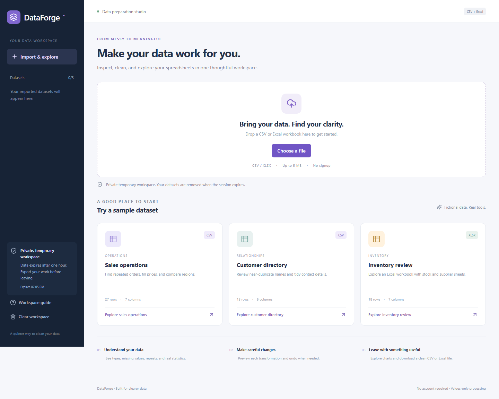
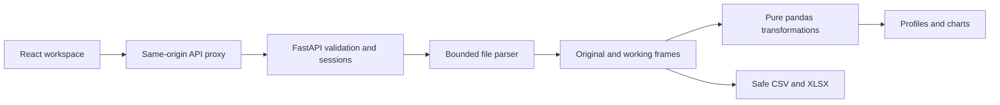

# DataForge

A private browser workspace for inspecting, cleaning and exploring CSV and Excel data, built as a professional software-development portfolio application.

[Live demo](https://dataforge-dina19.vercel.app) · [Source](https://github.com/alexdina712-dev/dataforge) · [Case study](PORTFOLIO_CASE_STUDY.md)

No account or API key is required. Choose a fictional sample dataset, preview a cleaning step, apply it, inspect charts and download the result. The free hosted API may need a minute to wake after inactivity.

## Features

- UTF-8 CSV and values-only XLSX uploads, with worksheet and delimiter selection.
- Profiles: rows, columns, inferred types, missing values, duplicate rows, numeric statistics and categorical summaries.
- Ten cleaning tools: deduplication, missing-row removal, mean/median numeric fills, categorical fills, column rename/removal, safe type conversion, trimming and snake_case names.
- Immutable original beside working previews; paginated browsing; preview before apply; revision-checked updates.
- Transformation history, exact replay-based undo and reset.
- Bar, histogram, line and scatter charts, explicit display limits and accessible underlying values.
- Advisory similar-value review without automatic fuzzy merges.
- Complete CSV/XLSX downloads, dataset deletion and clear-workspace controls.
- Responsive layouts with working loading, empty and error states.

## Screenshots



Additional verified screens are in [docs/screenshots](docs/screenshots). All screenshots use fictional data.

## Stack and architecture

React 19, TypeScript, Vite, modular CSS, Lucide and Zod; Python 3.12, FastAPI, pandas, openpyxl, defusedxml and Pydantic; pytest, Ruff, Vitest and Playwright. Versions are pinned by pnpm and Python lock files.



HTTP handlers delegate to separate parsing, profiling, transformation, storage and export modules. Frontend hooks own session/dataset lifecycle; modular views and reusable tables/charts own presentation. All data operations run in server-side Python. No user-provided code is accepted.

### Why no database or accounts?

This is a temporary utility. A random HttpOnly cookie scopes all private datasets; the server stores its digest, never its raw token. One-hour absolute expiry, explicit deletion and service restart remove datasets. A PostgreSQL dependency would add persistence this workflow does not need. This architecture deliberately differs from the other portfolio applications.

**Export before leaving.** Reload recovers a still-live session, but restart loses everything. Deploy one API worker. Scaling requires a shared store and redesigned retention controls.

## Project structure

```text
backend/app/       API, security, parsing, profiling, transformations, storage, exporting
backend/tests/     Domain/API/security tests and malformed file fixtures
src/components/    Upload dialog, tables, charts, reusable UI
src/hooks/         Private workspace state and lifecycle
src/lib/           Types, API client, client-side validation
src/pages/         Import, overview, preview, clean, charts, history
samples/           Three fictional datasets, including a two-sheet workbook
e2e/               Six critical workflows, desktop and mobile
scripts/           Local launcher and deployment configuration
docs/              API, pipeline, privacy, deployment, verification
```

## Installation

Prerequisites: Python **3.12**, Node **22–24**, pnpm **11.19.0**. No database or cloud credentials are needed locally.

```bash
git clone https://github.com/alexdina712-dev/dataforge.git
cd dataforge
python -m venv .venv
```

Activate: Windows PowerShell `.venv/Scripts/Activate.ps1`; macOS/Linux `source .venv/bin/activate`.

```bash
python -m pip install -r backend/requirements-dev.txt
corepack enable
corepack prepare pnpm@11.19.0 --activate
pnpm install --frozen-lockfile
```

Copy `.env.example` to `.env`; defaults already work. In two terminals:

```bash
python -m uvicorn app.main:app --app-dir backend --host 127.0.0.1 --port 8004 --workers 1 --limit-concurrency 20
pnpm dev
```

Open http://127.0.0.1:5176. Development API docs: http://127.0.0.1:8004/api/docs. Vite proxies same-origin API requests.

Windows setup/start and stop are in `scripts/Start-DataForge.ps1` and `scripts/Stop-DataForge.ps1`, operating only on this app and ports 8004/5176.

### Environment

| Variable | Default | Purpose |
|---|---|---|
| ENVIRONMENT | development | production enables Secure cookies/required origin, disables API docs |
| APP_ORIGIN | http://127.0.0.1:5176 | Exact frontend origin, no trailing slash |
| SESSION_TTL_SECONDS | 3600 | Absolute retention, clamped to 60–86400 seconds |
| MAX_STORE_BYTES | 100663296 | Original+working frame accounting budget, 96 MiB |
| SERVE_WEB | unset | true serves compiled frontend for the container alternative |

No persistent signing/database secret is required; sessions are random server-side capabilities. Hosting credentials belong in private tooling, never frontend/source backups.

## Pipeline and limits

Bound request bytes → validate container → parse rectangular data → infer types → profile → preview/apply pure transformation → increment revision/history → export.

5 MiB file; 10,000 rows; 50 columns; 250,000 cells; 2,000 characters per cell; 80-character unique headers; three datasets/session; 20 steps/dataset; 200 live sessions. XLSX expansion is capped at 20 MiB, with ZIP-entry/ratio and coordinate checks before openpyxl. Import/export work is serialized to reduce peak memory.

Statistics use observed values; standard deviation is sample-based (`ddof=1`). Completeness measures populated cells, not a synthetic quality score. Fractional mean fills promote integer columns. Incompatible casts reject atomically. Numbers must be finite and JavaScript-safe; dates use YYYY-MM-DD. Leading-zero identifiers stay text; literal NA/null strings do not become missing.

[Pipeline semantics](docs/DATA_PIPELINE.md) · [API endpoints and examples](docs/API.md).

## Privacy and security

Private routes verify ownership, returning 404 for another session's dataset. Cookies are HttpOnly, SameSite=Lax and Secure in production. Exact-origin mutation checks, no-store APIs, safe errors, rate limits and bounded retention protect the workflow.

Macros, formulas, workbook external links and embedded objects are rejected. CSV formula-like text/headers gain an apostrophe; numeric negatives remain numbers. XLSX explicitly writes strings as strings. No code or formula executes.

Frames live in RAM. Multipart input is bounded before parsing. openpyxl export uses temporary XML artifacts removed during completion; this is not a claim of zero filesystem activity. No permanent upload store or content analytics exists. Infrastructure still processes requests and may retain operational metadata. [Privacy details](docs/PRIVACY.md).

## Tests

```bash
python -m ruff check backend
python -m ruff format --check backend
python -m pytest
pnpm test
pnpm build
pnpm exec playwright install chromium
pnpm test:e2e
```

pytest covers pure transforms, malformed files, exports, sessions, ownership, expiry, revisions and resource/security boundaries. Vitest checks client validation and zero/false/missing formatting. Six Playwright workflows use real frontend/API instances on desktop and mobile Chromium. Tests remove their fictional datasets.

GitHub Actions runs lint/unit/API/build checks and browser tests, retaining browser diagnostics on failure. Starlette currently emits an upstream httpx TestClient deprecation warning; tests pass without replacing its transport.

Set PUBLIC_BASE_URL to the canonical frontend and run `pnpm test:e2e:public` for deployed verification. Do not repeatedly run heavy suites on the shared free demo; import rate limits are intentional.

## Deployment

Vercel Hobby static frontend; free Render Python backend; one worker; no database. A same-origin /api rewrite keeps cookies first-party. [Deployment instructions](docs/DEPLOYMENT.md) cover environment, commands and rollback.

A multi-stage Dockerfile provides a single-container alternative: `docker compose up --build`, port 8080. See verification notes for execution status; local/hosted native deployments are the primary tested paths.

## Decisions and known limitations

Original+working frames and replay history avoid 20 full snapshots. Preview/revision checks protect reviewed changes from stale tabs. Values-only parsing rejects formula workbooks instead of showing potentially stale cached values.

CSV formula-leading text gains an apostrophe, sacrificing exact text round trips for safety. Workbook styles, merges, charts and formulas are not preserved; one worksheet is imported/exported at a time. UTF-8 only, no date-locale guessing. Charts/similarity review are bounded exploratory aids. Large data is intentionally rejected.

The frame budget is accounting, not a hard OS memory sandbox. The public demo has no independent security audit, durable collaboration, queued ETL or permanent audit history. Free-service restart loses sessions; no artificial keep-alive traffic is used.

Future work: shared expiring storage, queued/streaming imports, user-confirmed value mappings, schema templates, more encodings and accessible chart navigation.

## Portfolio and licensing

Implemented with AI assistance and verified through automated tests and real browser workflows. Documentation records engineering evidence, not a claim that the owner independently wrote or already mastered every module. Studying and extending it is the next interview-preparation step.

Source is available for portfolio review; **no open-source license grant is supplied**. Original project rights are reserved to preserve deliberate future commercial licensing. Third-party dependencies retain their licenses; commercial hosting/dependency obligations need review before launch.

References: [FastAPI uploads](https://fastapi.tiangolo.com/tutorial/request-files/), [pandas CSV](https://pandas.pydata.org/docs/reference/api/pandas.read_csv.html), [openpyxl](https://openpyxl.readthedocs.io/en/stable/), [Render FastAPI](https://render.com/docs/deploy-fastapi).
